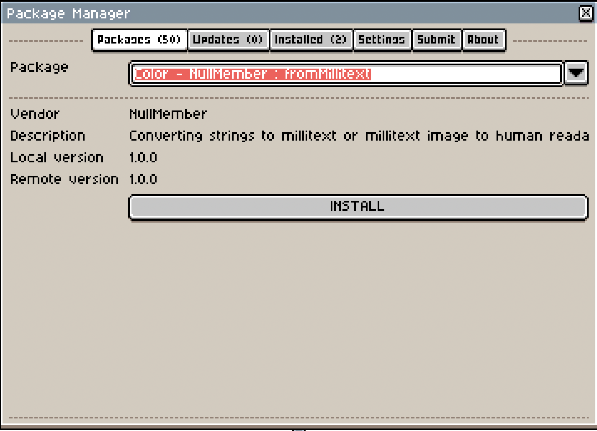
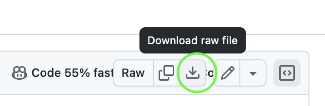

# Aseprite Package Manager

# Installation

1. Download only this file [src/Package Manager.lua](https://github.com/SignalFromTheStars/aseprite-package-manager/blob/main/src/Package%20Manager.lua). 
    
2. In **Aseprite**, open the **Scripts** folder: File > Scripts > Open Scripts Folder.
3. Copy the downloaded file into the **Scripts** folder.
4. Restart Aseprite to load **'Package Manager'**, or use the **Scripts** menu to refresh the scripts for immediate availability.

# TODO
- [x] install packages
- [x] uninstall packages
- [x] update packages
- [x] submit package
- [x] website url meta data
- [x] not possible to download anymore (only localhost)
- [x] update package manager
- [x] fill metadata.json scripts
- [x] rename root script
- [x] live url
- [x] repo not private anymore
- [x] test windows
- [x] test mac
- [x] update this readme
- [ ] support zip files 
- [ ] linter
- [ ] lua check
- [ ] test ubuntu
- [ ] publish website topic
- [ ] publish aseprite forum
